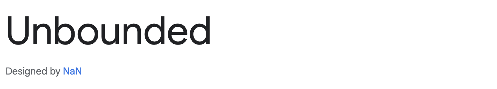

# *Rock Paper Scissors Game*

Welcome to the Rock Paper Scissors game! This simple web-based game allows you to play the classic Rock, Paper, Scissors game against the computer. The game keeps track of your wins, losses, and ties, and it provides an overall winner after a set number of rounds.

The game can be accessed by clicking [here](https://vtoth13.github.io/rock-paper-scissors)

---
## User Stories

- As a player, I want to have fun with the game.

- As a player, I want to be prompted to enter my name if it's my first time playing or if my name hasn't been set.

- As a player, I want to see the result of each round displayed on the screen, indicating whether I won, lost, or it's a tie.

- As a player, I want to see the current score (wins, losses, ties) updated after each round.

- As a player, I want to view the rules of the game by clicking on the "Game Rules" button.

- As a player, I want to know the overall winner after a set number of rounds.

- As a player, I want the option to play again after seeing the overall winner.

- As a player, I want to be able to close the game rules popup by pressing the 'Esc' key.
---
## Getting Started

To start playing the game, simply click the "Start Game" button. If it's your first time playing or if your name hasn't been set, you will be prompted to enter your name. Your name will be saved for future sessions.
---

## How to Play

After starting the game, you can choose Rock, Paper, or Scissors by clicking on the respective buttons.
 - The computer will randomly select its move.
 - The result of the round will be displayed, indicating whether you won, lost, or it's a tie.
 - The score will be updated accordingly.
 - After 10 rounds it is shown who the overall winner is
---

## Game Rules

Objective: The objective of Rock, Paper, and Scissors is to defeat your opponent by choosing an item that beats their chosen item.


### Items:
- Rock: Represented by a closed fist, rock crushes scissors.
- Paper: Represented by an open hand, paper covers rock.
- Scissors: Represented by a fist with the index and middle finger extended, scissors cut paper.

### Winning and Losing
1. Rock crushes scissors, so if you choose a rock and your opponent chooses scissors, you win.
2. Paper covers rock, so if you choose paper and your opponent chooses rock, you win.
3. Scissors cut paper, so if you choose scissors and your opponent chooses paper, you win.
#### Ties: If both players choose the same item, the game is a tie, and it is usually played again to determine the winner.
---

## Features
- **Score Tracking:** The game keeps track of wins, losses, and ties for each player.

- **Player Initialization:** Allows players to input their names to personalize the game experience.

- **UI Display:** Results are displayed in the user interface (UI) for easy understanding.

- **Moves Left Counter:** Displays the number of moves left for the player.

- **Game Rules Popup:** Provides a popup with game rules for player reference.

- **Random Computer Moves:** The computer opponent makes random moves (rock, paper, or scissors).

- **Overall Winner Announcement and Play Again Option:** At the end of the game, announce the overall winner or if it's a tie. It also allows players to choose to play again, resetting the game.

- **Esc Key Handling:** This enables closing the popup with the Esc key.

#### If you want to play again, click the "Yes" button in the popup after determining the overall winner. If you decide not to play again, click the "No" button. By clicking the "No" button, the name is going to be removed, and a new player name can be entered.
---

## Testing
### Responsive Testing
- [Mobile](documentation/chrome_phone.PNG)
- [Desktop](documentation/safari_computer.png)

### Compatibility Testing
- [Google Chrome - Desktop](documentation/chrome_desktop.png)
- [Safari - Desktop](documentation/safari_desktop.png)
- [MS Edge - Desktop](documentation/ms_edge_desktop.jpeg)
- [Google Chrome - Mobile](documentation/chrome_phone.PNG)
- [Safari Mobile](documentation/safari_phone.PNG)

### Validator Testing
- [HTML](documentation/html_validation.png)
- [CSS](documentation/css_validation.png)
- [JavaScript](documentation/js_validation.png)

### Accessibility and Performance

---

## Bugs
### Solved bugs
- The function to close the popup with the "Esc" button didn't seem to work when I tried to identify the key as "Esc"
    - Solution: I used the KeyCode instead ```keyCode === 27```

- The player was able to Enter an empty name in the prompt
    - Solution: ``` if (!playerName || playerName.trim() === "") {``` This condition checks if playerName is falsy (which includes null, undefined, an empty string, etc.) or if playerName consists of only whitespace characters after trimming it.

### Unsolved Bugs
- None

## Deployment

### Deployment to GitHub Pages

- The site was deployed to GitHub pages. The steps to deploy are as follows: 
  - In the [GitHub repository](https://github.com/vtoth13/rock-paper-scissors), navigate to the Settings tab 
  - From the source section drop-down menu, select the **Main** Branch, then click "Save".
  - The page will be automatically refreshed with a detailed ribbon display to indicate the successful deployment.

The live link can be found [here](https://vtoth13.github.io/rock-paper-scissors)

### Local Deployment
To make a local copy of this project, you can clone it.
In your IDE Terminal, type the following command to clone my repository:

- `git clone https://github.com/vtoth13/rock-paper-scissors.git`

- Alternatively, if you use Gitpod, you can [click here](https://gitpod.io/#https://github.com/vtoth13/rock-paper-scissors), which will start the Gitpod workspace for you.
---

## Future improvements
- **Enhanced User Interface:** Implement a more visually appealing and interactive UI to enhance user experience.
- **Difficulty Levels:** Introduce different difficulty levels for the computer opponent, offering varying levels of challenge.
- **Animations:** Introduce animations to make the game feel more dynamic and engaging.
- Add favicon with [Favicon Generator. For real.](https://realfavicongenerator.net/)
---

## Technologies Used

- [HTML](https://developer.mozilla.org/en-US/docs/Web/HTML) - was used as the foundation of the site
- [CSS](https://developer.mozilla.org/en-US/docs/Web/css) - was used to add the styles and layout of the site
- [CSS Flexbox](https://developer.mozilla.org/en-US/docs/Learn/CSS/CSS_layout/Flexbox) - was used to arrange items symmetrically on the page
- [Google Fonts](https://fonts.google.com) - were used to import fonts
- [VS Code](https://code.visualstudio.com) - was used as the main tool to write and edit code
- [GitHub](https://github.com) - was used to host the code of the website
- [GitHub Pages](https://pages.github.com) - was used to present the website
- [Canva](https://canva.com) - was used for the emojis and the planning of the game
---

## Design
Color scheme

### Font

The font was chosen to be readable and modern-looking.

### Credit
#### Content
- The code to make Scaling Font-sizes was taken from [Medium](https://sjorswijsman.medium.com/3-easy-css-tricks-for-responsive-websites-i-use-in-every-project-68ec334a1522)
- The circled styling and the solution for the scores were taken from [SuperSimpleDev](https://www.youtube.com/@SuperSimpleDev)

#### Pictures
- I got all the pictures from [Canva Pro](https://canva.com)
---

## Acknowledgments
- [Iuliia Konovalova](https://github.com/IuliiaKonovalova) was a great mentor and I express my sincere gratitude to my mentor for invaluable guidance and support throughout my project. Their expertise and encouragement significantly contributed to the success of this endeavor.
- Norbert Bartus, my finacé played a crucial role in supporting and guiding me throughout this project. Their encouragement and assistance in deciphering the correct utilization of specific properties were immensely valuable.
- [Code Institute](https://codeinstitute.net/) tutors and Slack community members for their support and help.
- [SuperSimpleDev](https://www.youtube.com/@SuperSimpleDev) for his amazing tutorials and explanation 
